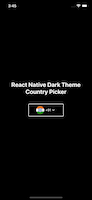

# react-native-custom-country-picker

## Getting started

`$ npm install @logisticinfotech/react-native-custom-country-picker --save`

### Mostly automatic installation

`$ react-native link @logisticinfotech/react-native-custom-country-picker`

## Usage
```javascript
import CountryPicker from '@logisticinfotech/react-native-custom-country-picker';

// TODO: What to do with the module?
CountryPicker;
```

## Country picker with Country Code with custom color and theme for react native support both platform iOS and Android

1. country picker plugin.
2. Cross platform compatibility android and ios both.
3. Search country using country name.
4. Support multiple language.
5. Dynamically change dropdown, search and back button images.
6. Customizable search bar style,container style and text colors.
7. Change animation(Slide, fade, none).
8. Support dark and light theme.

## Installation

> **npm install @logisticinfotech/react-native-custom-country-picker --save**

  

## Usage

```tsx
import React, {useState} from 'react';
import {StatusBar, StyleSheet, Text, View} from 'react-native';
import CountryPicker from '@logisticinfotech/react-native-custom-country-picker';

const App = () => {
  const [countryCode, setCountryCode] = useState<string>('IN');

  const selectedValue = (value: string) => {
    console.log(value);
    setCountryCode(value);
  };

  return (
    <View style={styles.container}>
      <StatusBar
        backgroundColor={'#000'}
        barStyle="light-content"
        translucent
      />
      <Text style={styles.titleText}>
        React Native Dark Theme Country Picker
      </Text>

      <CountryPicker
        disable={false}
        animationType={'slide'}
        containerStyle={styles.pickerStyle}
        pickerTitleStyle={styles.pickerTitleStyle}
        dropDownImage={require('./res/ic_drop_down.png')}
        selectedCountryTextStyle={styles.selectedCountryTextStyle}
        countryNameTextStyle={styles.countryNameTextStyle}
        pickerTitle={'Country Picker'}
        searchBarPlaceHolder={'Search......'}
        hideCountryFlag={false}
        hideCountryCode={false}
        searchBarStyle={styles.searchBarStyle}
        countryFlagStyle={styles.roundImageStyle}
        dropDownImageStyle={styles.dropDownStyle}
        flatListStyle={styles.flatListStyle}
        theme={'dark'}
        backButtonImage={require('./res/ic_back_black.png')}
        searchButtonImage={require('./res/ic_search.png')}
        countryCode={countryCode}
        hideSearchBar={false}
        hidePickerTitle={true}
        selectedValue={selectedValue}
      />
    </View>
  );
};
export default App;

const styles = StyleSheet.create({
  container: {
    flex: 1,
    justifyContent: 'center',
    alignItems: 'center',
    backgroundColor: '#000',
  },
  titleText: {
    color: '#fff',
    fontSize: 25,
    marginBottom: 25,
    fontWeight: 'bold',
    textAlign: 'center',
  },
  pickerTitleStyle: {
    justifyContent: 'center',
    flexDirection: 'row',
    alignSelf: 'center',
    fontWeight: 'bold',
  },
  pickerStyle: {
    height: 54,
    width: 150,
    marginVertical: 10,
    borderColor: '#efefef',
    alignItems: 'center',
    marginHorizontal: 10,
    padding: 10,
    backgroundColor: '#000',
    borderRadius: 5,
    borderWidth: 2,
    fontSize: 16,
    color: '#fff',
  },
  selectedCountryTextStyle: {
    paddingLeft: 5,
    color: '#fff',
    textAlign: 'right',
  },

  countryNameTextStyle: {
    paddingLeft: 10,
    textAlign: 'right',
  },

  searchBarStyle: {
    flex: 1,
  },
  roundImageStyle: {
    height: 34,
    width: 34,
    borderRadius: 17,
  },
  dropDownStyle: {
    tintColor: '#fff',
  },
  flatListStyle: {
    padding: 5,
  },
});

```

## Properties

```
  animationType?: "none" | "slide" | "fade" | undefined;                  defaultValues: ===>  "slide"
  containerStyle?: ViewStyle;
  searchBarStyle?: ViewStyle;
  searchBarContainerStyle?: ViewStyle;
  pickerTitleStyle?: TextStyle;
  countryNameTextStyle?: TextStyle;
  selectedCountryTextStyle?: TextStyle;
  dropDownImage?: ImageSourcePropType;                                    defaultValues: ===>require("./res/ic_drop_down.png")
  backButtonImage?: ImageSourcePropType;                                  defaultValues: ===>require("./res/ic_back_black.png")
  searchButtonImage?: ImageSourcePropType;                                defaultValues: ===>require("./res/ic_search.png")
  dropDownImageStyle?: ImageStyle;
  countryFlagStyle?: ImageStyle;
  flatListStyle?: ViewStyle;
  safeAreaStyle?: ViewStyle;
  theme: "dark" | "light";                                                defaultValues: ===> "light"
  countryCode?: string | any;                                             defaultValues: ===>"IN"
  hideCountryFlag?: boolean;                                              defaultValues: ===> false
  hideCountryCode?: boolean;                                              defaultValues: ===> false
  searchBarPlaceHolder?: string;                                          defaultValues: ===>"Search..."
  pickerTitle?: string;                                                   defaultValues: ===> ""
  disable?: boolean;                                                      defaultValues: ===> false
  selectedValue?: Function;                                               defaultValues: ===> ""
  hideSearchBar?: boolean;                                                defaultValues: ===> false
  hidePickerTitle?: boolean;                                              defaultValues: ===>true
  language:
    | "common"
    | "ces"
    | "cym"
    | "deu"
    | "fra"                                                               defaultValues:==> "common"
    | "hrv"
    | "ita"
    | "jpn"
    | "nld"
    | "por"
    | "rus"
    | "slk"
    | "spa"
    | "fin"
    | "est"
    | "zho"
    | "pol"
    | "urd"
    | "kor";                                                            
```

## Country Code
  {
  'AF',
  'AL',
  'DZ',
  'AS',
  'AD',
  'AO',
  'AI',
  'AQ',
  'AG',
  'AR',
  'AM',
  'AW',
  'AU',
  'AT',
  'AZ',
  'BS',
  'BH',
  'BD',
  'BB',
  'BY',
  'BE',
  'BZ',
  'BJ',
  'BM',
  'BT',
  'BO',
  'BA',
  'BW',
  'BV',
  'BR',
  'IO',
  'VG',
  'BN',
  'BG',
  'BF',
  'BI',
  'KH',
  'CM',
  'CA',
  'CV',
  'BQ',
  'KY',
  'CF',
  'TD',
  'CL',
  'CN',
  'CX',
  'CC',
  'CO',
  'KM',
  'CK',
  'CR',
  'HR',
  'CU',
  'CW',
  'CY',
  'CZ',
  'CD',
  'DK',
  'DJ',
  'DM',
  'DO',
  'EC',
  'EG',
  'SV',
  'GQ',
  'ER',
  'EE',
  'SZ',
  'ET',
  'FK',
  'FO',
  'FJ',
  'FI',
  'FR',
  'GF',
  'PF',
  'TF',
  'GA',
  'GM',
  'GE',
  'DE',
  'GH',
  'GI',
  'GR',
  'GL',
  'GD',
  'GP',
  'GU',
  'GT',
  'GG',
  'GN',
  'GW',
  'GY',
  'HT',
  'HM',
  'HN',
  'HU',
  'IS',
  'IN',
  'ID',
  'IR',
  'IQ',
  'IE',
  'IM',
  'IL',
  'IT',
  'CI',
  'JM',
  'JP',
  'JE',
  'JO',
  'KZ',
  'KE',
  'XK',
  'KW',
  'KG',
  'LA',
  'LV',
  'LB',
  'LS',
  'LR',
  'LY',
  'LI',
  'LT',
  'LU',
  'MO',
  'MK',
  'MG',
  'MW',
  'MY',
  'MV',
  'ML',
  'MT',
  'MH',
  'MQ',
  'MR',
  'MU',
  'YT',
  'MX',
  'FM',
  'MD',
  'MC',
  'MN',
  'ME',
  'MS',
  'MA',
  'MZ',
  'MM',
  'NA',
  'NR',
  'NP',
  'NL',
  'NC',
  'NZ',
  'NI',
  'NE',
  'NG',
  'NU',
  'NF',
  'KP',
  'MP',
  'NO',
  'OM',
  'PK',
  'PW',
  'PS',
  'PA',
  'PG',
  'PY',
  'PE',
  'PH',
  'PN',
  'PL',
  'PT',
  'PR',
  'QA',
  'CG',
  'RO',
  'RU',
  'RW',
  'RE',
  'BL',
  'SH',
  'KN',
  'LC',
  'MF',
  'PM',
  'VC',
  'WS',
  'SM',
  'SA',
  'SN',
  'RS',
  'SC',
  'SL',
  'SG',
  'SX',
  'SK',
  'SI',
  'SB',
  'SO',
  'ZA',
  'GS',
  'KR',
  'SS',
  'ES',
  'LK',
  'SD',
  'SR',
  'SJ',
  'SE',
  'CH',
  'SY',
  'ST',
  'TW',
  'TJ',
  'TZ',
  'TH',
  'TL',
  'TG',
  'TK',
  'TO',
  'TT',
  'TN',
  'TR',
  'TM',
  'TC',
  'TV',
  'UG',
  'UA',
  'AE',
  'GB',
  'US',
  'UM',
  'VI',
  'UY',
  'UZ',
  'VU',
  'VA',
  'VE',
  'VN',
  'WF',
  'EH',
  'YE',
  'ZM',
  'ZW',
  'KI',
  'HK',
  'AX'
}